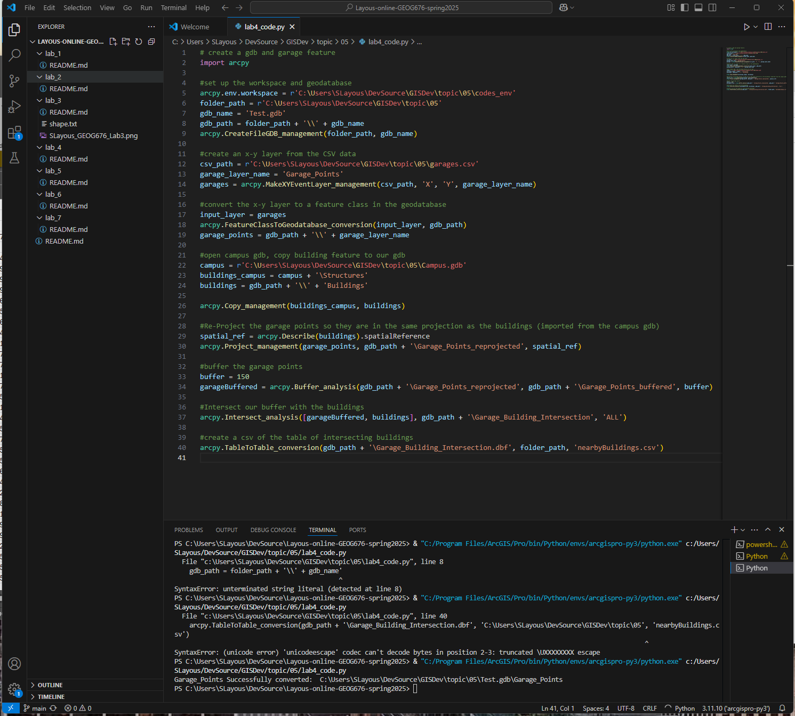

# Lab 4

**Sierra Layous**

```
# create a gdb and garage feature
import arcpy

#set up the workspace and geodatabase
arcpy.env.workspace = r'C:\Users\SLayous\DevSource\GISDev\topic\05\codes_env'
folder_path = r'C:\Users\SLayous\DevSource\GISDev\topic\05'
gdb_name = 'Test.gdb'
gdb_path = folder_path + '\\' + gdb_name
arcpy.CreateFileGDB_management(folder_path, gdb_name)

#create an x-y layer from the CSV data
csv_path = r'C:\Users\SLayous\DevSource\GISDev\topic\05\garages.csv'
garage_layer_name = 'Garage_Points'
garages = arcpy.MakeXYEventLayer_management(csv_path, 'X', 'Y', garage_layer_name)

#convert the x-y layer to a feature class in the geodatabase
input_layer = garages
arcpy.FeatureClassToGeodatabase_conversion(input_layer, gdb_path)
garage_points = gdb_path + '\\' + garage_layer_name

#open campus gdb, copy building feature to our gdb
campus = r'C:\Users\SLayous\DevSource\GISDev\topic\05\Campus.gdb'
buildings_campus = campus + '\Structures'
buildings = gdb_path + '\\' + 'Buildings'

arcpy.Copy_management(buildings_campus, buildings)

#Re-Project the garage points so they are in the same projection as the buildings (imported from the campus gdb)
spatial_ref = arcpy.Describe(buildings).spatialReference
arcpy.Project_management(garage_points, gdb_path + '\Garage_Points_reprojected', spatial_ref)

#buffer the garage points
buffer = 150
garageBuffered = arcpy.Buffer_analysis(gdb_path + '\Garage_Points_reprojected', gdb_path + '\Garage_Points_buffered', buffer)

#Intersect our buffer with the buildings
arcpy.Intersect_analysis([garageBuffered, buildings], gdb_path + '\Garage_Building_Intersection', 'ALL')

#create a csv of the table of intersecting buildings
arcpy.TableToTable_conversion(gdb_path + '\Garage_Building_Intersection.dbf', folder_path, 'nearbyBuildings.csv')
```


