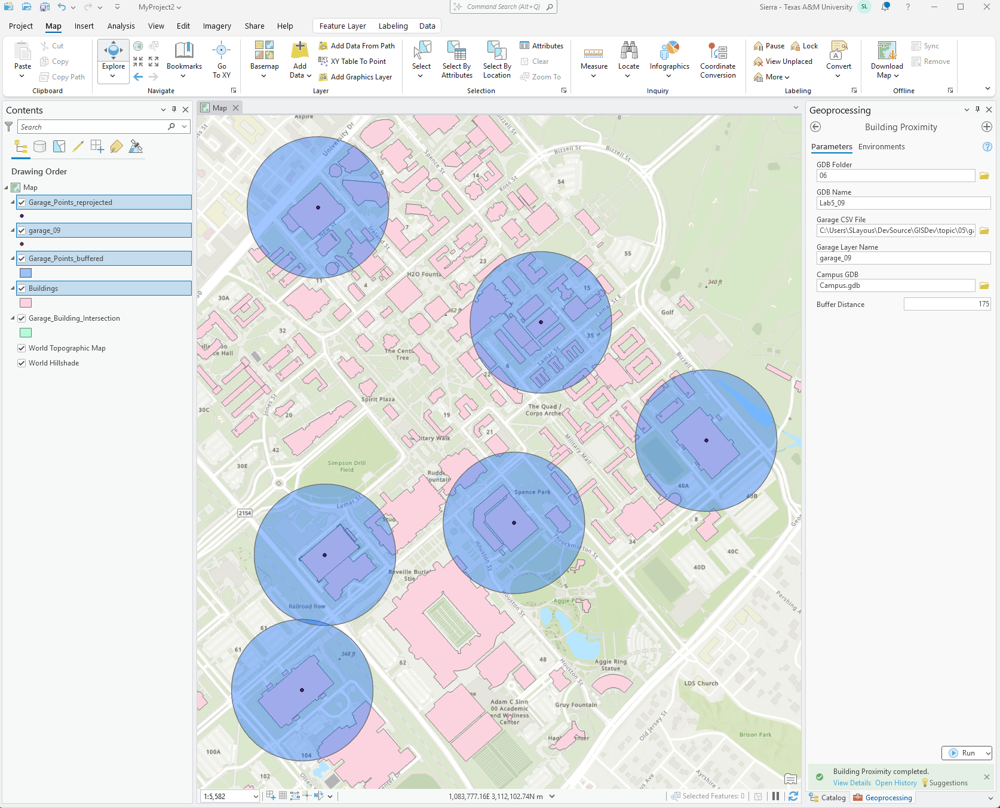

# Lab 5

**Sierra Layous**

NOTE: I designed the tool so you type in the name of the output geodatabase, but you don't need to include ".gdb".

```
#turning lab 4 into a toolbox

import arcpy

class Toolbox(object):
    def __init__(self):
        """Define the toolbox (the name of the toolbox is the name of the .pyt file)"""
        self.label = "Toolbox"
        self.alias = ""

        #List of tool classes associated with this toolbox
        self.tools = [Tool]

class Tool(object):
    def __init__(self):
        """Define the tool (tool name is the name of the class)."""
        self.label = "Building Proximity"
        self.description = "Determines which buildings on TAMU's campus are near a targeted building"
        self.canRunInBackground = False
        self.category = "Building Tools"

    def getParameterInfo(self):
        """Define parameter definitions"""
        param0 = arcpy.Parameter(
        displayName="GDB Folder",
        name="GDBFolder",
        datatype="DEFolder",
        parameterType="Required",
        direction="Input"
         )
        param1 = arcpy.Parameter(
        displayName="GDB Name",
        name="GDBName",
        datatype="GPString",
        parameterType="Required",
        direction="Input"
         )
            
        param2 = arcpy.Parameter(
        displayName="Garage CSV File",
        name="GarageCSVFile",
        datatype="DEFile",
        parameterType="Required",
        direction="Input"
         )
            
        param3 = arcpy.Parameter(
        displayName="Garage Layer Name",
        name="GarageLayerName",
        datatype="GPString",
        parameterType="Required",
        direction="Input"
         )
            
        param4 = arcpy.Parameter(
        displayName="Campus GDB",
        name="CampusGDB",
        #corrected the datatype from DEType to DEWorkspace
        datatype="DEWorkspace",
        parameterType="Required",
        direction="Input"
         )
            
        param5 = arcpy.Parameter(
        displayName="Buffer Distance",
        name="BufferDistance",
        datatype="GPDouble",
        parameterType="Required",
        direction="Input"
         )
        parameters = [param0, param1, param2, param3, param4, param5]
        return parameters
        
    def isLicensed(self):
        """Set whether tool is licensed to execute"""
        return True
        
    def updateParameters(self, parameters):
        """Modify the values and properties of parameters before internal validation is performed. 
        This method is called whenever a parameter has been changed."""
        return
        
    def updateMessages(self, parameters):
        """Modify the messages created by internal validation for each tool parameter. This method 
        is called after internal validation."""
        return
        
    def execute(self, parameters, messages):
        """The source code of the tool."""
        #set up the workspace and geodatabase
        folder_path = parameters[0].valueAsText
        gdb_name = parameters[1].valueAsText
        #added + '.gdb' to get ArcGIS to recognize the folder as a geodatabase
        gdb_path = folder_path + '\\' + gdb_name + '.gdb'
        arcpy.CreateFileGDB_management(folder_path, gdb_name)

        #create an x-y layer from the CSV data
        csv_path = parameters[2].valueAsText
        garage_layer_name = parameters[3].valueAsText
        garages = arcpy.MakeXYEventLayer_management(csv_path, 'X', 'Y', garage_layer_name)
          
        #convert the x-y layer to a feature class in the geodatabase
        input_layer = garages
        arcpy.FeatureClassToGeodatabase_conversion(input_layer, gdb_path)
        garage_points = gdb_path + '\\' + garage_layer_name

        #open campus gdb, copy building feature to our gdb
        campus = parameters[4].valueAsText
        buildings_campus = campus + '\Structures'
        buildings = gdb_path + '\\' + 'Buildings'

        arcpy.Copy_management(buildings_campus, buildings)

        #Re-Project the garage points so they are in the same projection as the buildings (imported from the campus gdb)
        spatial_ref = arcpy.Describe(buildings).spatialReference
        arcpy.Project_management(garage_points, gdb_path + '\Garage_Points_reprojected', spatial_ref)

        #buffer the garage points
        buffer_distance = int(parameters[5].value)
        #corrected the buffer_distance so it is not hardwired as 150, but is whatever the user inputs
        garageBuffered = arcpy.Buffer_analysis(gdb_path + '\Garage_Points_reprojected', gdb_path + '\Garage_Points_buffered', buffer_distance)

        #Intersect our buffer with the buildings
        arcpy.Intersect_analysis([garageBuffered, buildings], gdb_path + '\Garage_Building_Intersection', 'ALL')

        #create a csv of the table of intersecting buildings
        # added the buffer distance to the CSV file name for clarity
        arcpy.TableToTable_conversion(gdb_path + '\Garage_Building_Intersection.dbf', folder_path, 'nearbyBuildings_' + str(buffer_distance) + 'm.csv')

        return None
```

